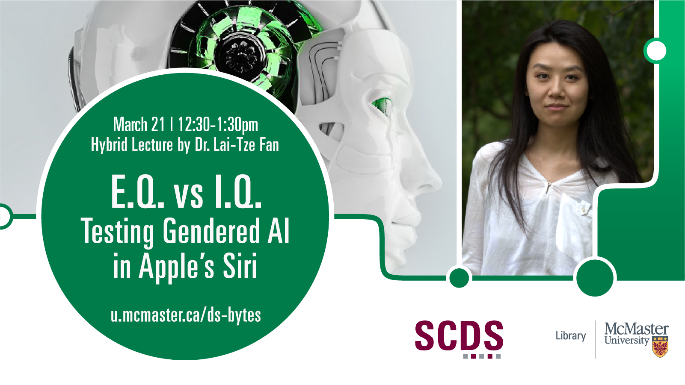

# EQ vs IQ: Testing Gendered AI in Apple's Siri

Day and Time: Tuesday March 21, 2023 | 12:30-1:30pm

**Abstract:** The Turing Test—a thought experiment by mathematician Alan Turing in which a human and a computer try to convince an interrogator that they are human—is actually based on another thought experiment by Turing: the Imitation Game—in which a man and woman try to convince an interrogator that they are a woman. In other words, a theoretical test by which we measure human-like performance was inspired by a test of gendered performance.

Today, descriptions of high IQ are attributed to machines capable of advanced decision making, including in machine learning. Meanwhile, AI designed to provide EQ-heavy labour in care, customer service, and comfort are predominantly female presenting.

In this talk, Fan will explore how the gendering of AI assistants is just a new method in a long history of abstracting women and their bodies into labouring machines, in effect nullifying the need to ask the Turing Test question of “human or machine.” Instead, AI assistants play a modified Imitation Game, trying to trick users into accepting machine as woman. By exploring industry designers’ research findings, Fan will confront the argument that “women’s voices tend to be better received by consumers, and that from an early age we prefer listening to female voices” (Tambini 2022). Performing tests on Apple’s AI assistant Siri, she will argue that when assessing such AI for human-like performance, designers are not looking for intelligence, but rather, for efficacy to get the job done—content production, menial task completion, and capital transactions—with a smile.

**Speaker Bio:** Lai-Tze Fan is the Director of the forthcoming research-creation-focused Unseen-AI Lab, and an Assistant Professor of Sociology & Legal Studies and English Literature at the University of Waterloo, Canada. Her work focuses systemic inequalities in technological design and labour, methods of digital storytelling, research-creation, and critical making, and media theory and infrastructure.

Fan serves as an Editor and the Director of Communications of electronic book review and an Editor of the digital review. She is Co-Editor of the collection Post-Digital: Dialogues and Debates from electronic book review (Bloomsbury 2020), and is the Editor of special journal issues on “Canadian Digital Poetics” and “Critical Making, Critical Design.” The latter issue received the Electronic Literature Organization’s 2022 N. Katherine Hayles Prize for Criticism. She is Co-Editor of the forthcoming book collection EnTwine: A Critical and Creative Companion to Teaching with Twine with open-access publication Amherst College Press. Fan also makes digital and material art on computational poetics, e-waste, feminist crafts, and fashion.

## Watch a Recording of "EQ vs IQ: Testing Gendered AI in Apple's Siri"

<iframe height="480" width="853" allowfullscreen frameborder=0 src="https://echo360.ca/media/0cb01c76-d32d-436a-99a2-762746722966/public"></iframe>
View the original [here](https://echo360.ca/media/0cb01c76-d32d-436a-99a2-762746722966/public).

