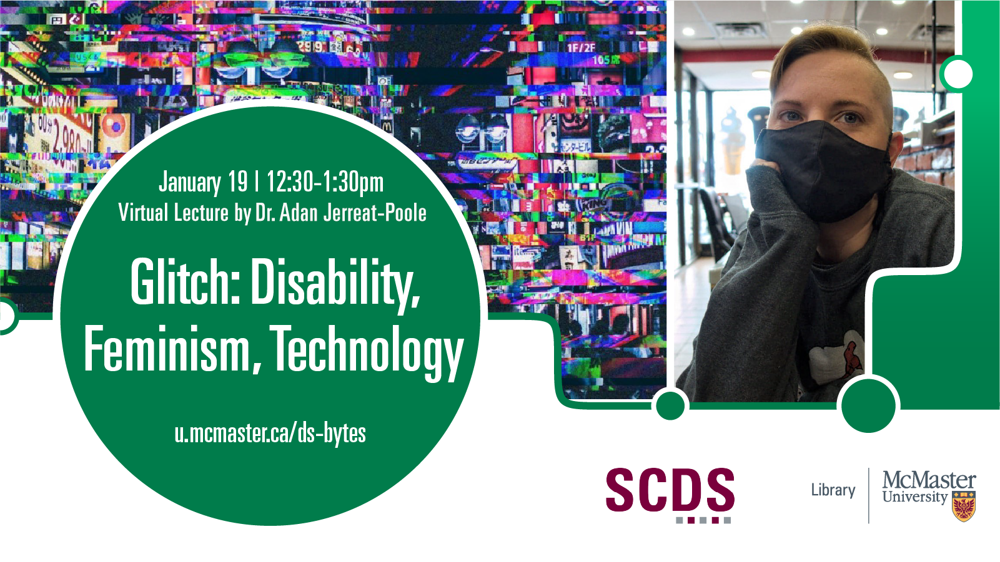

# Glitch: Disability, Feminism, Technology

**Abstract:** In the TV show The Good Place (2016-2020), each heavenly neighborhood is run by a “Janet,” a feminized personal assistant with access to all the information in the universe. In season 2, Janet glitches, causing earthquakes to rock the world and large swaths of the neighbourhood to disappear. Starting from the representation of glitching robots on-screen before moving to technologies, bodies, and communities off-screen, this presentation will explore the history of “glitch feminism” and then turn to glitch as intimacy, interdependence, and Mad/crip/queer community, glitch understood through the physiology of pain in relation to technology, and glitch as a reorientation towards crip time.

Glitch: A surge of current or a spurious electrical signal… a sudden short-lived irregularity in behaviour… a hitch or snag; a malfunction (OED).

As Jerreat-Poole writes, “Glitch resonates with me as a Mad/disabled person and scholar. We have glitchy brains and glitchy bodies that don’t always do what we ask of them or what society demands of them. We have twinges and twitches and tics, both visible and invisible. We have our behaviour read as irregular or strange (Janet’s wild laughter, her hair in disarray). A glitch can be a mistake, a pause, a redirection, a new field of possibility. Glitches, embodied and/or technical, can disrupt the smooth narrative of neoliberal progress and efficiency, opening up opportunities to imagine and construct digital communities that are sick, crip, Mad, disabled, neurodivergent, feminist, and queer.”

**Speaker Bio:** Adan (they/them) is a mad/crip/queer scholar and white settler living on treaty territory belonging to Six Nations of the Grand River and the traditional home of the Neutral, Anishinaabe, and Haudenosaunee peoples. Adan is an Assistant Professor at the University of Waterloo in the Department of Communication Arts. They work at the intersection of disability studies and digital media. Their current research explores how disabled queer and trans feminists create, advocate, and care for each other through and with digital technology, and how we can design, hack, mod, and build more ethical technologies, societies, and futures. Adan is also a creative writer and the author of the queer YA novels The Girl of Hawthorn and Glass and The Boi of Feather and Steel (Dundurn Press).

## Watch a Recording of "Glitch: Disability, Feminism, Technology"

<iframe height="480" width="853" allowfullscreen frameborder=0 src="https://echo360.ca/media/54535732-1c0c-43a1-884d-ff78df6e62ed/public"></iframe>

View the original [here](https://echo360.ca/media/54535732-1c0c-43a1-884d-ff78df6e62ed/public).
