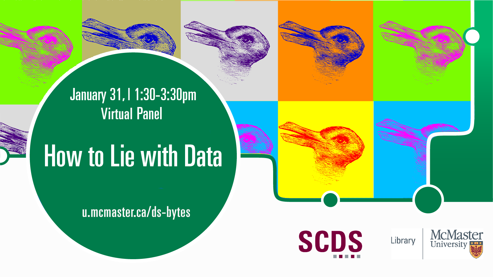

# How to Lie with Data

Day and Time: Tuesday January 31, 2023 | 1:30-3pm

**Abstract:** Data may seem objective or neutral, but that’s not always the case. At this roundtable, learn about how data can be manipulated, skewed, or collected so poorly that any findings are extremely suspect. This session aims to build critical literacy and build attendees’ understanding of data collection, statistics, visualizations including infographics, charts, graphs, and maps, and the Data Justice movement.

**Speakers:** Vass Bednar, Executive Director of the Public Policy in Digital Society Program at McMaster University; Cal Biruk, Associate Professor of Anthropology at McMaster University; Jeffrey Demaine, Bibliometrics and Research Impact Librarian at McMaster University; Saman Goudarzi, Cartographic Resources Librarian at McMaster University; Christine Homuth, Spatial Information Specialist at McMaster University; Subhanya Sivajothy, Data Analysis and Visualization Librarian at McMaster University. This event includes an introductory address by the Sherman Centre’s Co-Directors Dr. Jay Brodeur and Dr. Andrea Zeffiro. 

## Watch a Recording of "How to Lie with Data"

Coming Soon
