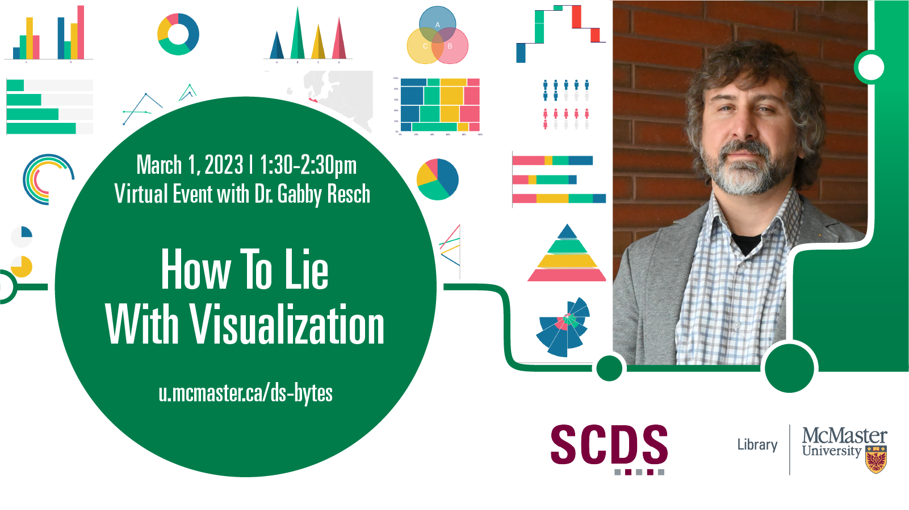

# How to Lie with Visualization

In 1996, two researchers at IBM, Bernice Rogowitz and Lloyd Treinish, published an important article titled “How Not to Lie with Visualization.” In it, they outlined a rule-based approach to visualization that would, they argued, help users navigate the increasingly complex space of data design. “The great flexibility of visualization,” Rogowitz and Treinish wrote, “can open a Pandora’s box of problems for the user and easily give rise to visual representations that do not adequately reveal the structure in the data or that introduce misleading visual artifacts.” Since the article’s publication, visualization systems have become both more ubiquitous and more complex, and rules-based approaches have hardly reduced the proliferation of deceptive graphics. In this talk and hands-on workshop, we will pry open the Pandora’s box that Rogowitz and Treinish describe! With a nod to Darrell Huff’s 1954 classic “How to Lie with Statistics,” we will examine range of visualization techniques and methods that are frequently used to lie, deceive, and manipulate – as well as a set of design criteria that can be used to counteract graphical deception.

Thematically, the talk will explore the emergence of data-driven media, the various ways that misleading and deceptive graphics are produced and disseminated, and the relationship between authority, trust, accuracy, persuasion, and literacy.

## Speaker Bios
Dr. Gabby Resch is an Assistant Professor in the Faculty of Business and Information Technology at Ontario Tech. His research explores new methods for making sense of data as it moves between physical and digital worlds. At the moment, he is engaged in three collaborative SSHRC and CIHR-funded research projects that explore geospatial visualization in the context of migration-related policy; scrolling interactives for medical knowledge translation; and immersive augmented and virtual reality medical training environments. Prior to joining Ontario Tech, he was a postdoctoral fellow with the Synaesthetic Media Lab at Toronto Metropolitan University, where he carried out research on virtual reality games designed to enhance spatial cognition, AR and VR environments for motor learning, and immersive media for medicine.

Dr. Resch received his PhD from the University of Toronto, where his research examined tangible and embodied approaches to data visualization. For a number of years, he has developed and taught innovative visualization and interaction design courses at the U of T, TMU, and Ontario Tech that provide hands-on opportunities for students to learn data design concepts. He also has extensive experience collaborating with various institutional partners, including Autodesk Research, the Ontario Science Centre, the Royal Ontario Museum, and the Art Gallery of Ontario. His various research interests examine tangible, AR, and VR contexts for data visualization; critical and human-centred approaches to data literacy; and immersive 3D media for spatial cognition.
