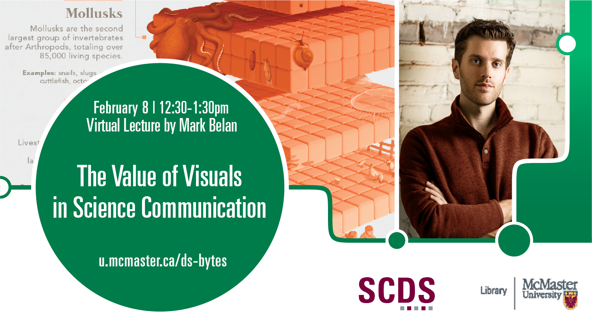

# The Value of Visuals in Science Communication

Day and Time: Wednesday February 8, 2023 | 12:30-1:30pm

**Abstract:** Science research relies on data to describe theories and stories, but communicating the complex, sophisticated, or sometimes esoteric information and relationships within these data is limited. Visual storytelling is becoming increasingly important in a data-driven world: from data visualizations to diagrammatic illustrations, telling science stories requires a visual component. The reasons for this lie in the way we process information.

This virtual talk by Mark Belan (Scientific Graphics Journalist) will introduce the basics of visual perception, its benefit to science communication efforts, and how anyone can manipulate design theory to create visuals (of whatever skill level) to tell impactful, effective, and ultimately better science stories.

**Speaker Bio:** Mark Belan is a scientific graphics journalist and visual communicator, working at the intersection of art and science to translate scientific concepts into impactful visuals. With two Master of Science degrees (one in Geochemistry/Astrobiology, another in Biomedical Communications), his work and past experience as a researcher has led him to champion the values of visual storytelling when communicating complex and sophisticated ideas, especially in science. Mark is based in Toronto, Canada and yearns to make science more accessible to everyone, with all forms of visual media. Learn more about Mark at [www.artscistudios.com.](www.artscistudios.com)

## Watch a Recording of "The Value of Visuals in Science Communication"

Coming Soon
