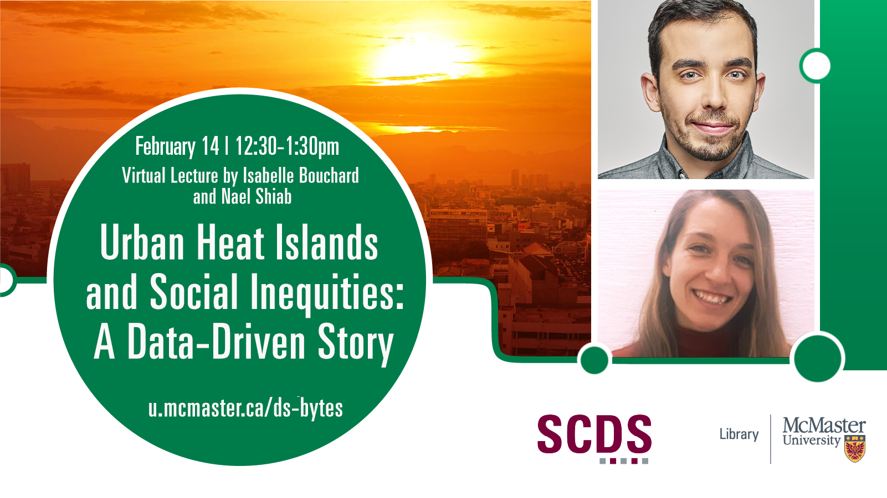

# Urban Heat Islands and Social Inequities: A Data-Driven Story

Day and Time: Tuesday February 14, 2023 | 12:30-1:30pm

**Abstract:** In this talk, Nael Shiab and Isabelle Bouchard (CBC Journalists) will present their work on urban heat islands and their correlation with some demographic indicators. More specifically, this work shows that immigrants and people with low income are most likely to live in the hottest urban areas. This makes them much more vulnerable to heat waves, with deadly consequences. Shiab and Bouchard will share their methodology and discuss how they used open data to highlight social inequalities. They will also explain the role of the interactive visualization to support their story.

[Read the Urban Heat Islands report.](https://ici.radio-canada.ca/info/2022/07/ilots-chaleur-villes-inegalites-injustice-changements-climatiques/en)

**Speaker Bios:** Nael works for CBC/Radio-Canada, the Canadian Broadcasting Company, as Senior Data Producer, interactive content and visualizations. Isabelle worked for CBC/Radio-Canada as a data scientist. Nael and Isabelle have been collaborating to produce major reports on urban sprawl and heat islands in Canada.

## Watch a Recording of "Urban Heat Islands and Social Inequities: A Data-Driven Story"

<iframe height="480" width="853" allowfullscreen frameborder=0 src="https://echo360.ca/media/d4746376-37c1-4444-807f-9e0f4e9a20cc/public"></iframe>
View the original [here](https://echo360.ca/media/d4746376-37c1-4444-807f-9e0f4e9a20cc/public).

