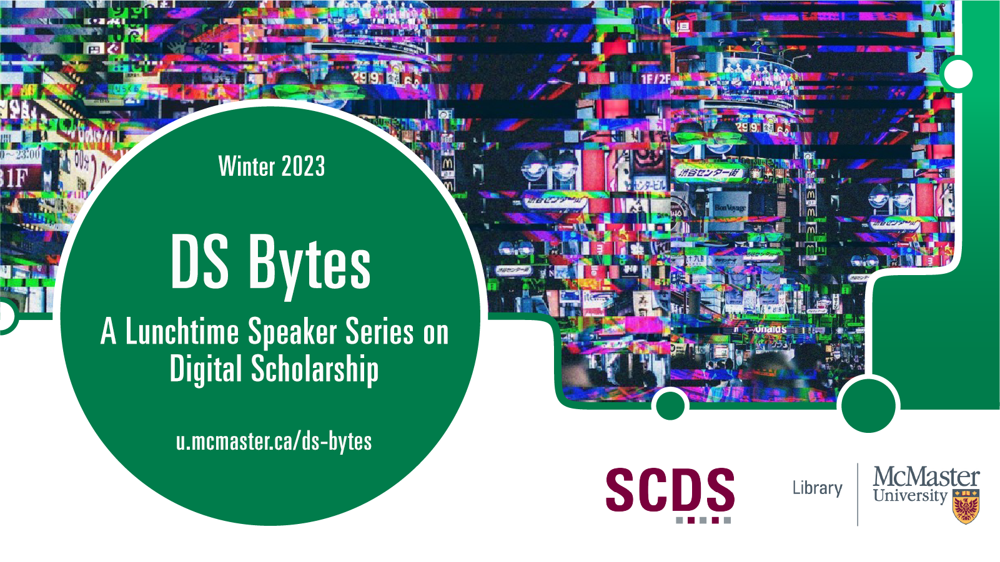

# Welcome to DS Bytes: A Lunchtime Speaker Series on Digital Scholarship 

DS Bytes is a six-part event series that will introduce attendees to prescient topics and methods in Digital Scholarship. A diverse group of DS practitioners, scholars, artists, and journalists will explore data, artificial intelligence, critical literacy, social justice, data visualization, and data literacy.

## DS Bytes Event Slate

This series includes the following events:
- ["Glitch: Disability, Feminism, Technology"](Glitch) - Dr. Adan Jerreat-Poole (Assistant Professor of Communication Arts, University of Waterloo)
- ["How to Lie with Data"](Howtoliewithdata) - A Panel of McMaster Faculty and Librarians: Vass Bednar, Cal Biruk, Jeffrey Demaine, Saman Goudarzi, Christine Homuth, and Subhanya Sivajothy  
- ["The Value of Visuals in Science Communication"](ScienceCommunication) - Mark Belan (Scientific Graphics Journalist)
- ["Urban Heat Islands and Social Inequalities: A Data-Driven Story"](UrbanHeatIslands) - Nael Shiab (Senior Data Producer, CBC) and Isabelle Bouchard (Data Scientist)
- ["How to Lie with Visualization"](Howtoliewithvisualization) - Dr. Gabby Resch (Assistant Professor of Information Visualization, Ontario Tech University)
- ["EQ vs IQ: Testing Gendered AI in Apple's Siri"](EQIQ) - Dr. Lai-Tze Fan (Assistant Professor of Sociology & Legal Studies and English Literature, University of Waterloo)

<!-- 
[Register for DS Bytes.](https://libcal.mcmaster.ca/calendar/scds?cid=7565&t=g&d=0000-00-00&cal=7565&ct=34374&inc=0) -->

